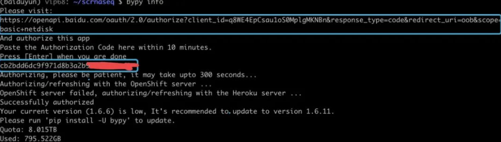

### 安装

在conda环境中安装即可

```shell
pip install -i https://pypi.tuna.tsinghua.edu.cn/simple bypy
```

### 第一次使用

第一次使用需要授权登录

```shell
bypy info
```




### 上传

```shell
#建议创建一个名为upload的文件夹，用于每日把需要备份上传的文件mv到该目录
#然后cd到该目录
cd upload
#把需要备份的文件mv到upload后，nohup后台开始上传，然后你就可以走人了。
nohup bypy upload &
#如果嫌上传的慢，可以调用多线程，同步起飞！
nohup bypy upload --processes 10 &

# tradition plan([ondup]表示如果远程目录有重命文件，该如何操作，可选overwrite（覆盖、默认选项）和newcopy（创建一个新的文件名）)
bypy upload <localpath> [remotepath] [ondup]
```


### 下载

首先安装aira2加速

```shell
conda install -c bioconda aria2
```

<br>然后下载

```shell
bypy downfile <remotefile> [localpath]	#download file
bypy downdir <remotefile> [localpath]	#download folder
bypy --downloader aria2 download [remotepath] [localpath]	#accelerate
```


查看文件夹

```shell
bypy list
```

